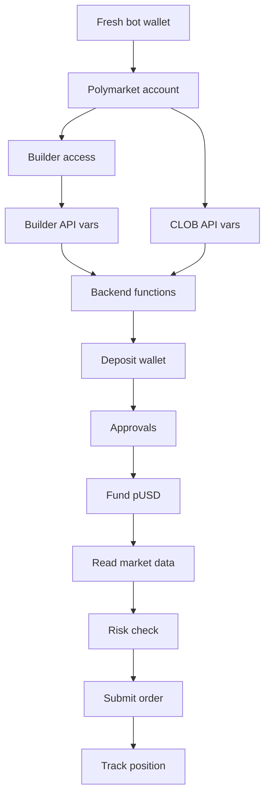
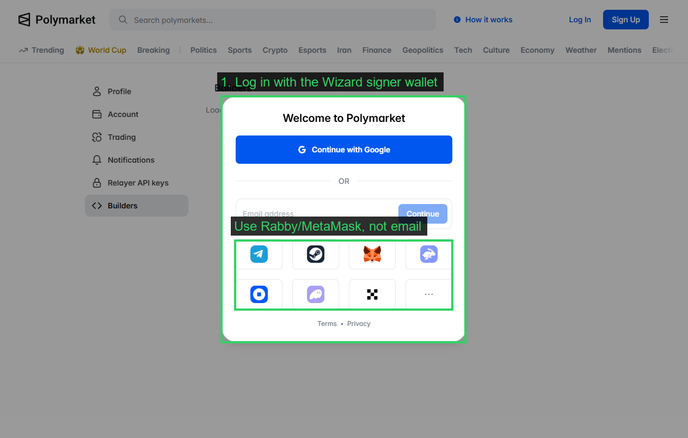
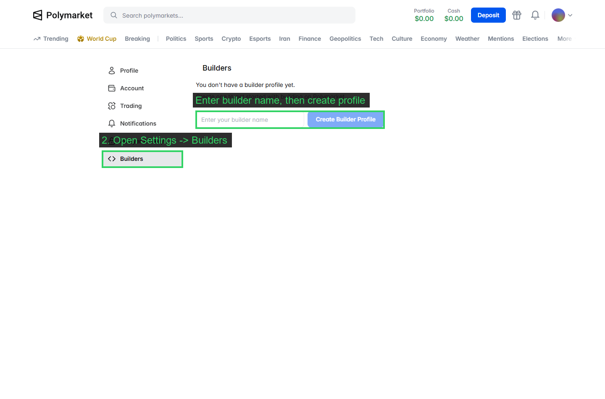
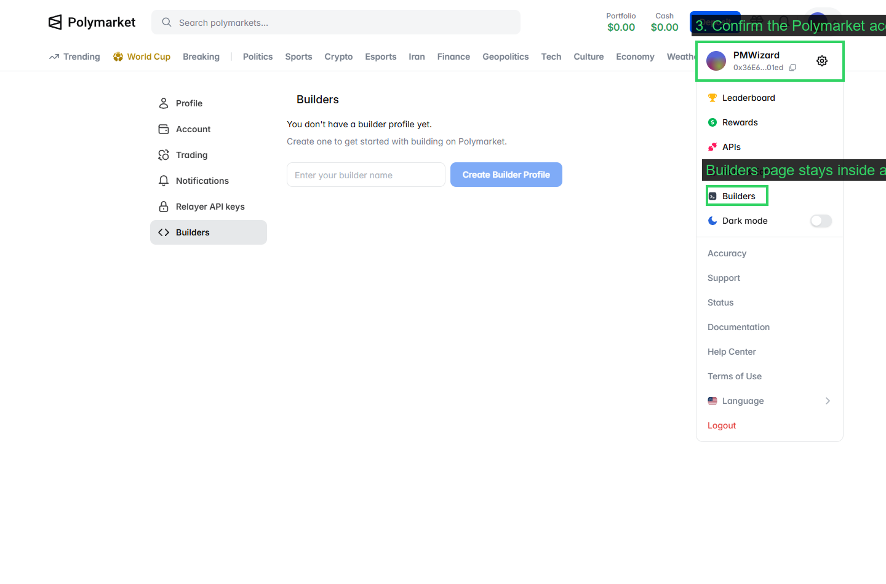
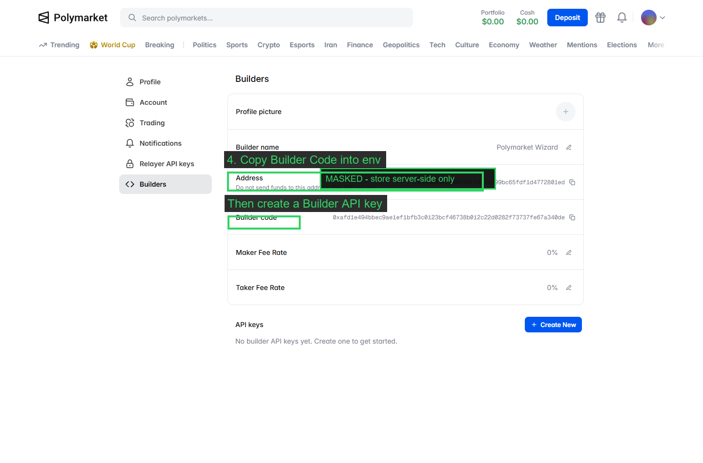
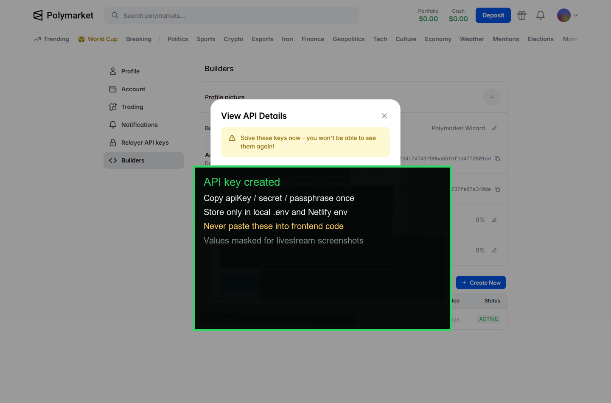
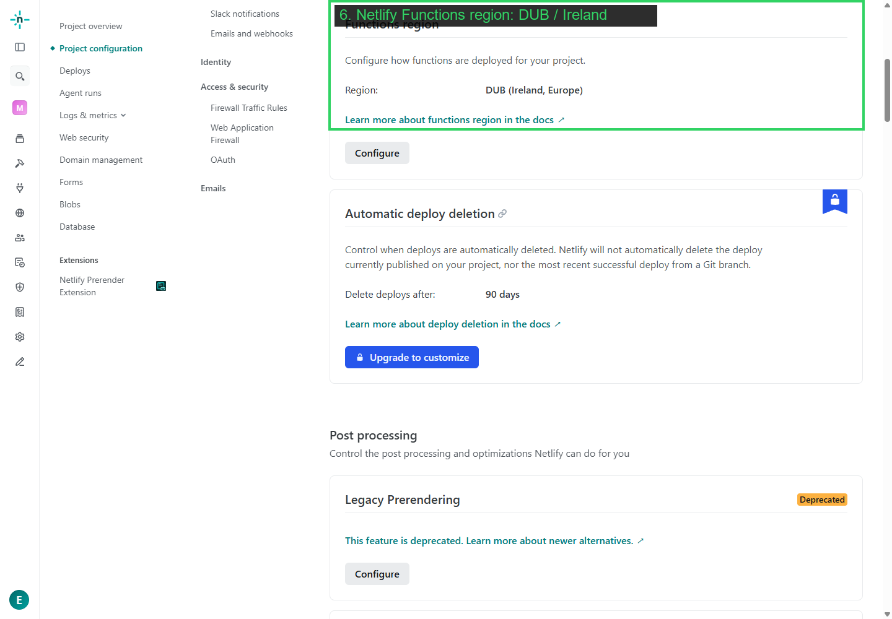

# What A Polymarket Trading Bot Must Do

This guide is the base layer. It is not a tour of the Polymarket Wizard UI.

The Wizard app is only one working prototype. The important thing is the checklist every Polymarket trading bot has to solve before it can place real orders.

Use a fresh wallet. Keep the funding tiny. This is hot-wallet infrastructure, not a place for personal funds.

Creator note: if this guide helps and you are creating a Polymarket account anyway, you can use the AlphaStack referral link: <https://polymarket.com/?via=alphastack-eymx>.

The frontend app repo is here:
<https://github.com/alphastack1/POLYMARKET-WIZARD/>.

## The Whole Bot Flow



That is the build. Everything else is app design.

## 1. Create A Dedicated Bot Wallet

Make a new wallet just for the bot.

Do not use your main wallet. Do not use a wallet with meaningful funds. The backend needs signing power, so this should be a small tool wallet.

The bot wallet needs:

- A Polymarket account.
- A little POL on Polygon for gas.
- Collateral that can become pUSD for trading.
- The same address used for Builder and CLOB credentials.

## 2. Connect That Wallet To Polymarket

Go to Polymarket and connect the bot wallet.



Use this same wallet for the whole build. Do not create Builder credentials with one wallet and CLOB credentials with another.

## 3. Create Builder Access

Builder access is needed for the relayer/deposit-wallet side of the app.

In Polymarket, create a Builder profile and confirm it with the bot wallet.





Copy the Builder Code.



Then create Builder API credentials and save:

- Builder API key.
- Builder secret.
- Builder passphrase.
- Builder code.



These are backend secrets. Never put them in frontend code.

## 4. Create CLOB API Credentials

The bot also needs CLOB credentials for order and market operations.

Save:

- CLOB API key.
- CLOB secret.
- CLOB passphrase.

These must match the bot wallet. If the wallet and keys do not match, order creation will fail.

## 5. Run The Backend From A Working Region

Private trading actions should run on a backend, not in the browser.

For this prototype, Netlify Functions worked with the Functions region set to Dublin, Ireland.



This matters because Polymarket sees the server request location. Your browser location is not the only thing that matters.

The Wizard repo uses:

```txt
Build command: npm run build
Publish directory: dist
Functions directory: netlify/functions
Functions region: Dublin, Ireland
```

## 6. Set The Required Environment Variables

These are the important backend variables for this prototype:

```txt
POLYGON_RPC_URL=

POLYMARKET_BUILDER_API_KEY=
POLYMARKET_BUILDER_SECRET=
POLYMARKET_BUILDER_PASSPHRASE=
POLYMARKET_BUILDER_CODE=

POLYMARKET_CLOB_API_KEY=
POLYMARKET_CLOB_SECRET=
POLYMARKET_CLOB_PASSPHRASE=

BOT_MNEMONIC=
AUTH_SECRET=
```

Useful optional variables:

```txt
BOT_ACCOUNT_INDEX=0
POLYGON_RPC_FALLBACKS=
POL_GAS_RESERVE=0.5
AUTH_ALLOWED_WALLETS=
```

Rules:

- `BOT_MNEMONIC` is the hot wallet seed phrase. Never commit it.
- `AUTH_SECRET` should be a separate random secret for session signing.
- Polymarket keys stay server-side.
- Anything prefixed with `VITE_` is browser-visible and must not contain secrets.

Old variables that this repo no longer uses:

```txt
MAX_DAILY_LOSS_USD
MAX_OPEN_POSITIONS
MAX_SPREAD_CENTS
MAX_TRADE_USD
MIN_HOURS_TO_RESOLUTION
MIN_LIQUIDITY_USD
POLYMARKET_RELAYER_API_KEY
POLYMARKET_RELAYER_API_KEY_ADDRESS
```

Risk limits in this prototype live in code, not in those old env vars.

## 7. Create The Deposit Wallet

A Polymarket trading bot does not only need a normal wallet. It also needs the Polymarket deposit wallet used for trading collateral.

The backend should:

1. Derive the deposit wallet address.
2. Check if it is already deployed.
3. Deploy it if needed through the Builder relayer.
4. Store or return the deposit wallet address.

In the Wizard repo, this logic lives in `netlify/functions/_polymarket.ts`.

## 8. Set The Required Approvals

After the deposit wallet exists, the bot needs approvals before it can trade smoothly.

The prototype sets approvals for:

- pUSD to the main Exchange.
- pUSD to the Negative Risk Exchange.
- pUSD to the Negative Risk Adapter.
- Conditional Tokens approval for the main Exchange.
- Conditional Tokens approval for the Negative Risk Exchange.

If approvals are missing, orders or exits can fail even if the wallet has funds.

## 9. Fund Trading Collateral

The bot needs pUSD available in the deposit wallet.

The prototype can:

- Use POL in the bot wallet.
- Swap POL to USDC.e.
- Wrap USDC.e into pUSD.
- Transfer pUSD into the deposit wallet.

You can fund a bot in a different way, but the end state is the same: the deposit wallet needs enough pUSD to cover the order.

## 10. Read Market Data Before Trading

Before placing an order, the bot needs live market data.

Typical data sources:

- Gamma API for market metadata, images, outcomes, and token IDs.
- CLOB API for live prices, order book, spread, history, and order submission.

Do not trust stale frontend data for a real order. The backend should re-check the market before submitting.

## 11. Run A Risk Check

Every bot needs a final server-side risk check.

At minimum, check:

- Market is active and accepting orders.
- Token IDs are available.
- Liquidity is high enough.
- Spread is not too wide.
- Trade size is inside your limit.
- The market is not too close to resolution.
- Deposit wallet has enough pUSD.

The exact limits are strategy choices. The existence of the checks is not optional.

## 12. Submit The Order

Once the wallet, credentials, deposit wallet, approvals, collateral, market data, and risk checks are ready, the backend can create and submit a signed CLOB order.

The browser should not sign with the bot key.

The browser can ask for an order. The backend decides whether that order is allowed.

## 13. Track Positions And Transactions

After an order, store enough history to explain what happened.

Track:

- Orders submitted.
- Positions opened.
- Sells or exits.
- Deposit wallet deployment transaction hashes.
- Approval transaction hashes.
- Funding and withdrawal transaction hashes.

CLOB orders are not always shown like a normal Polygon transfer. Setup, approval, deposit, funding, and withdrawal transactions are the cleanest Polygonscan proof points.

## How This Repo Fits

Polymarket Wizard is a working implementation of this base layer.

The app adds:

- A React frontend for testing.
- Wallet-gated controls.
- Market search.
- Live chart and order book.
- A small order ticket.
- Positions and activity views.
- Netlify Functions for all private actions.

You can redesign the frontend completely. The base layer above is the part that matters for any real Polymarket bot.

## Files To Study

| File | Why |
| --- | --- |
| `netlify/functions/_polymarket.ts` | Builder relayer, deposit wallet, approvals, funding, CLOB client, buy/sell flow. |
| `netlify/functions/_market.ts` | Gamma/CLOB market reads and validation helpers. |
| `netlify/functions/_env.ts` | Required env checks and risk limits. |
| `netlify/functions/_wallet.ts` | Hot wallet derivation and Polygon clients. |
| `src/App.tsx` | One possible testing UI for the backend flow. |

The repo proves the path works. The guide shows the path you need to rebuild in your own bot.
