# Polymarket Trading Wizard Build Guide

This guide shows the shortest reliable path to a guarded Polymarket trading app:

- Search live Polymarket markets.
- Fund one server-side trading wallet with POL.
- Convert only the needed POL into trading collateral.
- Deploy a Polymarket deposit wallet.
- Place guarded YES/NO trades.
- Sell positions manually.
- Poll stop-loss and take-profit rules while the app is open.

The design is intentionally simple: one hot wallet, one Netlify app, one trading console.

## What You Need

- A GitHub account.
- A Netlify account.
- A Polymarket account.
- Rabby or MetaMask.
- A fresh wallet used only for this bot.
- Enough POL on Polygon for gas and testing. For a first test, send enough POL to cover a small trade plus gas. The app shows the live POL-to-USD quote before depositing.
- Node.js 20+.

Do not use a personal wallet that holds meaningful funds. This project uses a server-side hot wallet, so treat it like an automation wallet with limited capital.

## App Flow

```mermaid
flowchart LR
  A["Create bot wallet"] --> B["Create Polymarket Builder access"]
  B --> C["Create CLOB API credentials"]
  C --> D["Set Netlify environment variables"]
  D --> E["Deploy app"]
  E --> F["Unlock with bot wallet signature"]
  F --> G["Send POL to bot wallet"]
  G --> H["Arm deposit wallet"]
  H --> I["Deposit pUSD"]
  I --> J["Search market"]
  J --> K["Buy or sell"]
```



## 1. Create the Bot Wallet

Create a fresh wallet in Rabby or MetaMask. Save the seed phrase somewhere secure.

This wallet is the only wallet that should control the app. The app requires this same wallet to sign in before it allows deposits, buys, sells, withdrawals, or bot account reads.

Store the seed phrase in local `.env.local` during development:

```txt
BOT_MNEMONIC="your twelve or twenty-four words"
BOT_ACCOUNT_INDEX=0
```

Never commit `.env.local`.

## 2. Log In To Polymarket With The Bot Wallet

Open Polymarket and connect the bot wallet.


Use the bot wallet for the whole setup. Do not create API keys from another wallet or another project.

## 3. Create Builder Access

Open the Polymarket Builder/API area and create a Builder profile for this bot wallet.


Confirm the wallet/account prompts.


Copy the Builder Code.


Add it to `.env.local` and Netlify:

```txt
POLYMARKET_BUILDER_CODE=
```

## 4. Create Builder API Keys

Create a Builder API key for the same bot wallet.


Save these values:

```txt
POLYMARKET_BUILDER_API_KEY=
POLYMARKET_BUILDER_SECRET=
POLYMARKET_BUILDER_PASSPHRASE=
```

These are server-side only. Never expose them in browser code.

## 5. Create CLOB Credentials

The CLOB credentials must also belong to the same bot wallet.

The app can derive or create them from the bot wallet during server-side setup. Once created, store them:

```txt
POLYMARKET_CLOB_API_KEY=
POLYMARKET_CLOB_SECRET=
POLYMARKET_CLOB_PASSPHRASE=
```

Do not reuse CLOB keys from a different wallet or app. The CLOB order signer, Builder code, and deposit wallet must all line up.

## 6. Configure Polygon RPC

Use a Polygon RPC that works reliably from Netlify Functions.

```txt
POLYGON_RPC_URL=https://polygon-bor-rpc.publicnode.com
POLYGON_RPC_FALLBACKS=https://polygon.drpc.org,https://polygon.llamarpc.com,https://polygon-rpc.com
POL_GAS_RESERVE=0.5
```

The app quotes POL dynamically at deposit time. It does not assume a fixed POL price.

## 7. Configure App Security

By default, only the bot wallet derived from `BOT_MNEMONIC` can unlock the app.

Optional overrides:

```txt
AUTH_ALLOWED_WALLETS=
AUTH_SECRET=
```

Leave `AUTH_ALLOWED_WALLETS` blank unless you intentionally want another admin wallet to unlock the bot. If you add more than one wallet, separate addresses with commas.

## 8. Netlify Setup

Create a Netlify site connected to your GitHub repo.

Build settings:

```txt
Build command: npm run build
Publish directory: dist
Functions directory: netlify/functions
```

Add every server-side env var from the sections above to Netlify.

Set the Functions region to Ireland / Dublin.


This matters because Polymarket region checks happen at the API edge. A region that is blocked or close-only can prevent buys even when your wallet and keys are valid.

## 9. Local Development

Install dependencies:

```bash
npm install
```

Create `.env.local`:

```txt
VITE_APP_MODE=hot-wallet
VITE_POLL_INTERVAL_MS=60000

POLYGON_RPC_URL=https://polygon-bor-rpc.publicnode.com
POLYGON_RPC_FALLBACKS=https://polygon.drpc.org,https://polygon.llamarpc.com,https://polygon-rpc.com

POLYMARKET_BUILDER_API_KEY=
POLYMARKET_BUILDER_SECRET=
POLYMARKET_BUILDER_PASSPHRASE=
POLYMARKET_BUILDER_CODE=

POLYMARKET_CLOB_API_KEY=
POLYMARKET_CLOB_SECRET=
POLYMARKET_CLOB_PASSPHRASE=

BOT_MNEMONIC=
BOT_ACCOUNT_INDEX=0
POL_GAS_RESERVE=0.5
AUTH_ALLOWED_WALLETS=
AUTH_SECRET=
```

Run the app through Netlify Dev so the Functions behave like production:

```bash
npm run build
npx netlify dev -d dist -f netlify/functions --port 8888
```

Open:

```txt
http://localhost:8888
```

## 10. First Live Test

Use a tiny test amount.

1. Open the deployed Netlify site.
2. Unlock with the bot wallet.
3. Send POL to the bot wallet shown in the app.
4. Click `Sync`.
5. Click `Arm` to deploy and approve the Polymarket deposit wallet.
6. Click `Deposit` to convert only the needed amount into pUSD.
7. Search a liquid, open market.
8. Pick YES or NO.
9. Buy the smallest allowed amount.
10. Confirm the position appears.
11. Sell the position.
12. Confirm the position disappears and the trade log updates.

## Guardrails

The app refuses to trade when:

- The wallet is not unlocked.
- Required environment variables are missing.
- The deposit wallet is not deployed.
- Polymarket approvals are missing.
- Deposit pUSD is too low.
- The market is closed or inactive.
- YES/NO token IDs are missing.
- The market is too close to resolution.
- Liquidity is too low.
- Spread is too wide.
- The trade is below the minimum size.

Those guardrails are code defaults, not user setup chores.

## What Not To Do

- Do not put secrets in frontend code.
- Do not use API keys from a different wallet.
- Do not use a high-value wallet as the bot wallet.
- Do not run production trading from a region Polymarket blocks.
- Do not assume POL price. Always quote live.
- Do not let public visitors call trading Functions without signed wallet auth.

## Troubleshooting

`Trading restricted in your region`

Change the Netlify Functions region. Dublin worked for this build.

`CLOB rejected order: not enough balance / allowance`

Run `Arm`, then `Deposit`, then `Sync`. The deposit wallet needs pUSD and max approvals.

`No CLOB history returned`

Some markets do not return recent price history. The app should still show live book data if the token has an order book.

`Wallet locked`

Connect the same wallet that created the bot credentials. A different wallet can view markets but cannot control funds.
