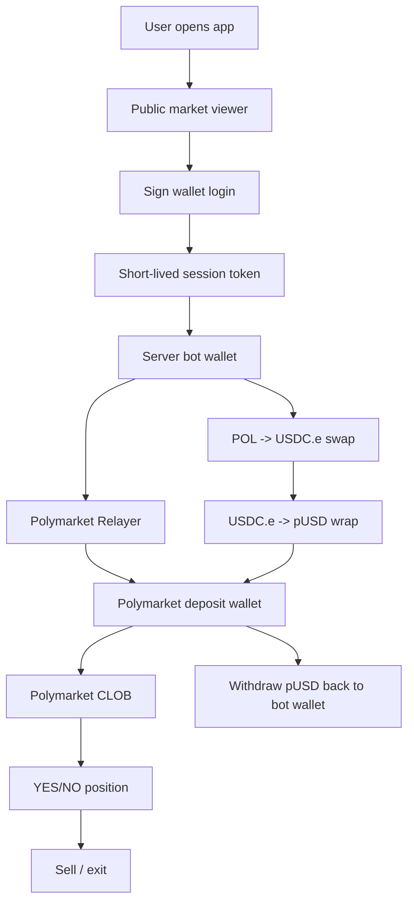
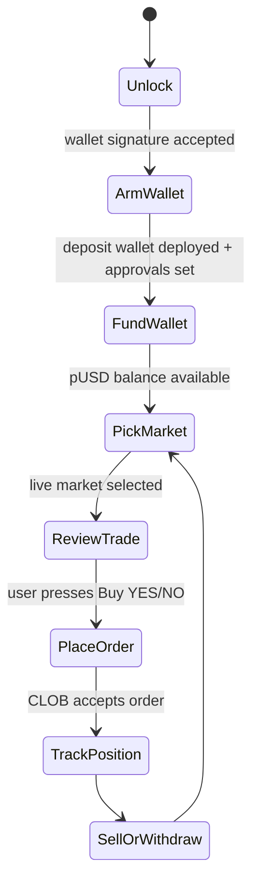
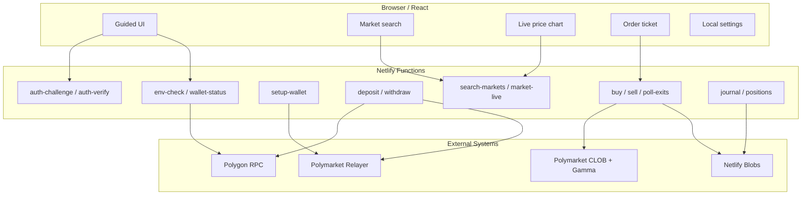
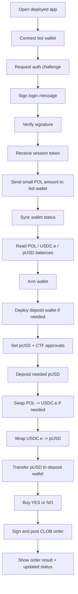
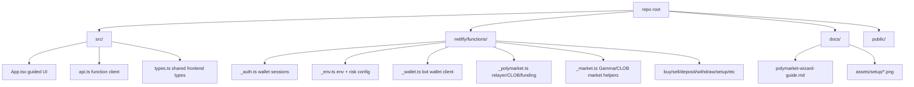
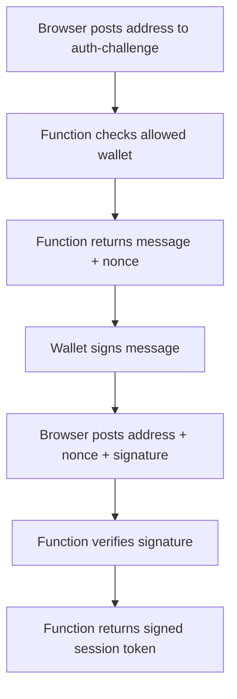
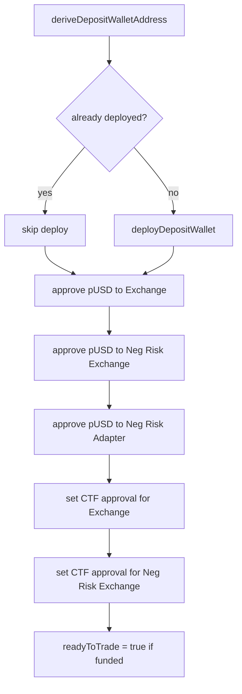
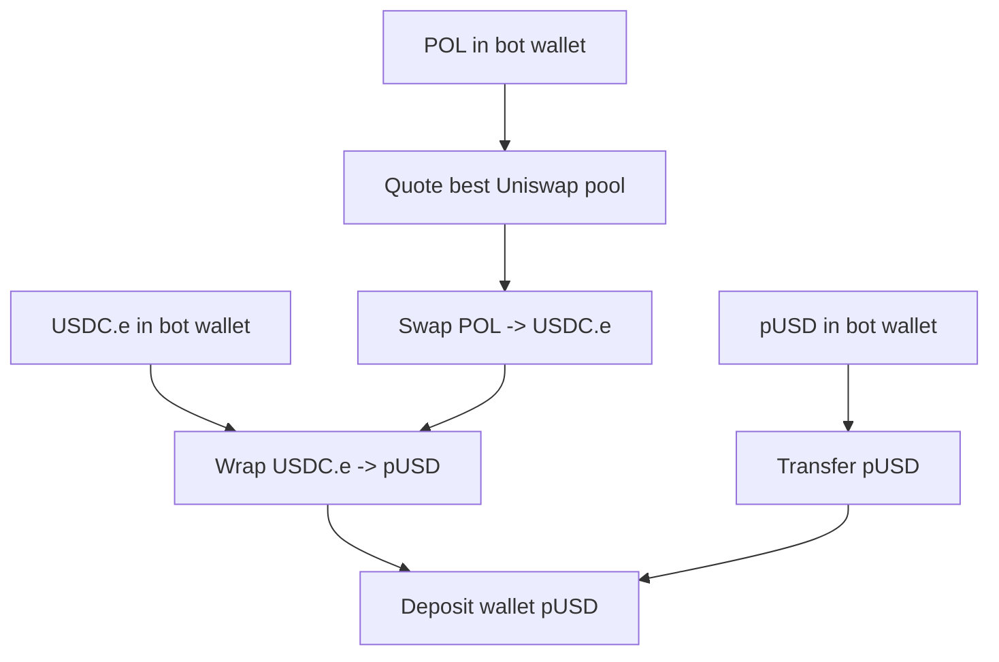
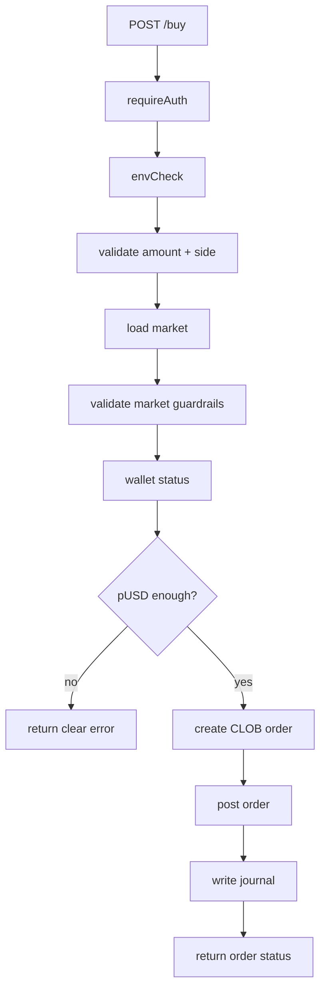
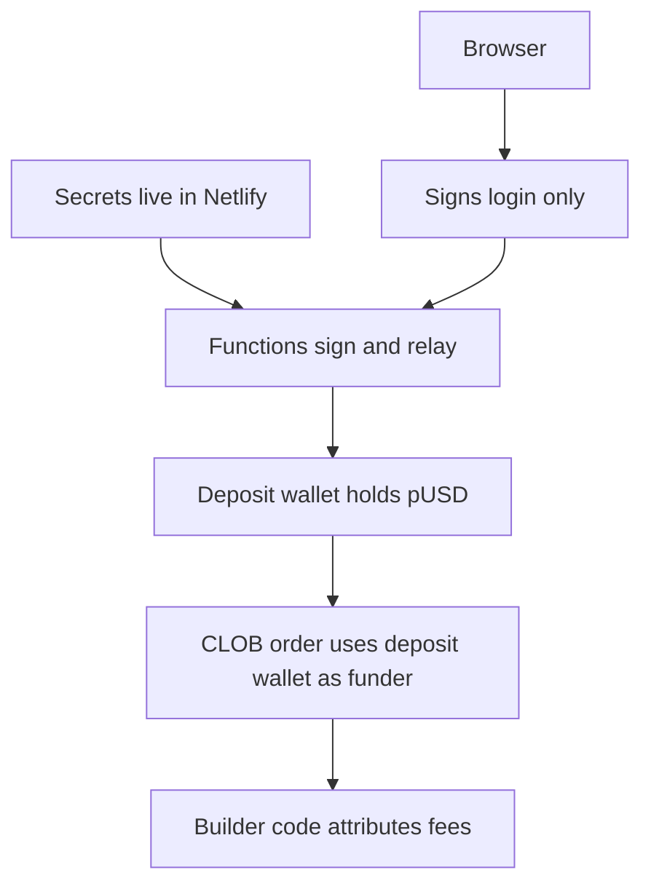

# Polymarket Wizard: Visual Build Guide

This guide explains how to build a basic but reliable Polymarket trading app:

- One dedicated bot wallet.
- One Netlify app.
- Server-side Netlify Functions for all private trading actions.
- Public frontend for search, charts, and the guided trade flow.
- Signed wallet login before any action can move funds or place orders.

The UI can be redesigned however you want. The important part is the backend flow: wallet auth, environment setup, Polymarket Builder/Relayer credentials, deposit wallet setup, funding, trading, selling, and withdrawal.

## The Whole App In One Picture



The core idea is simple: the browser never receives private keys. The browser asks Netlify Functions to do private work, and the Functions only obey requests from the authorized wallet session.

## What The User Sees



The frontend should feel like a guided journey, not a giant control panel. At each step there should be one obvious next action.

Current build note: manual buy, sell, deposit, and withdrawal actions are live. Automatic stop-loss/take-profit exits are disabled until duplicate-order protection and live exit previews are added.

## What Runs Where



## Required Accounts And Tools

| Need | Why |
| --- | --- |
| GitHub account | Host the repo. |
| Netlify account | Deploy frontend and Functions. |
| Polymarket account | Create Builder access and API keys. |
| Rabby or MetaMask | Create/connect the bot wallet. |
| Fresh bot wallet | Holds only limited trading funds. |
| POL on Polygon | Pays gas and can be swapped into collateral. |
| Node.js 20+ | Local development. |

Use a fresh wallet. Do not use a wallet with meaningful personal funds. This app uses a server-side hot wallet by design.

## Setup Screenshots

These screenshots show the important Polymarket and Netlify setup screens.

### 1. Connect The Bot Wallet To Polymarket


Use the same bot wallet for every key and credential. Do not mix wallets across projects.

### 2. Create Builder Access


Confirm the Polymarket account/wallet prompt.


Copy the Builder Code.


### 3. Create Builder API Credentials


Save the key, secret, and passphrase immediately. Treat them like secrets.

### 4. Choose The Netlify Function Region


For this build, Dublin worked. Region matters because Polymarket API access can be blocked or restricted depending on where the server request exits.

## Environment Variables

Put these in `.env.local` for local development and in Netlify environment variables for production.

```txt
# Public frontend config
VITE_APP_MODE=hot-wallet
VITE_POLL_INTERVAL_MS=60000

# Polygon RPC
POLYGON_RPC_URL=https://polygon-bor-rpc.publicnode.com
POLYGON_RPC_FALLBACKS=https://polygon.drpc.org,https://polygon.llamarpc.com,https://polygon-rpc.com
POL_GAS_RESERVE=0.5

# Polymarket Builder / Relayer
POLYMARKET_BUILDER_API_KEY=
POLYMARKET_BUILDER_SECRET=
POLYMARKET_BUILDER_PASSPHRASE=
POLYMARKET_BUILDER_CODE=

# Polymarket CLOB
POLYMARKET_CLOB_API_KEY=
POLYMARKET_CLOB_SECRET=
POLYMARKET_CLOB_PASSPHRASE=

# Bot wallet
BOT_MNEMONIC=
BOT_ACCOUNT_INDEX=0

# App auth
AUTH_ALLOWED_WALLETS=
AUTH_SECRET=
```

Notes:

- `BOT_MNEMONIC` is the hot wallet seed phrase. Never commit it.
- `AUTH_ALLOWED_WALLETS` can usually stay blank. If blank, the app allows only the wallet derived from `BOT_MNEMONIC`.
- `AUTH_SECRET` signs browser sessions. If blank, the backend falls back to existing private env values, but production should set it explicitly.
- Keep all Polymarket secrets server-side. Do not prefix them with `VITE_`.

## Netlify Configuration

The repo uses this Netlify shape:

```txt
Build command: npm run build
Publish directory: dist
Functions directory: netlify/functions
```

Minimal `netlify.toml`:

```toml
[build]
  command = "npm run build"
  publish = "dist"
  functions = "netlify/functions"

[functions]
  node_bundler = "esbuild"

[dev]
  command = "npm run dev"
  targetPort = 5173
  port = 8888
  publish = "dist"
```

Local run:

```bash
npm install
npm run build
npx netlify dev -d dist -f netlify/functions --port 8888
```

Open:

```txt
http://localhost:8888
```

Use Netlify Dev, not plain Vite, when testing anything that touches Functions.

## First Live Test Flow



Checklist:

1. Deploy the Netlify site.
2. Open the app.
3. Unlock with the bot wallet.
4. Send a small amount of POL to the bot address shown in the app.
5. Click `Sync`.
6. Click `Arm wallet`.
7. Click `Deposit`.
8. Search for a live, liquid market.
9. Review YES/NO prices.
10. Place the smallest allowed trade.
11. Confirm activity log and position state update.
12. Test sell.
13. Test withdraw.

## Guardrails

The app should refuse to trade when:

- The wallet session is missing or expired.
- Required env vars are missing.
- The deposit wallet is not deployed.
- Approvals are missing.
- Deposit pUSD is too low.
- The market is closed, inactive, or missing token IDs.
- The market is too close to resolution.
- Liquidity is too low.
- Spread is too wide.
- Trade size is below minimum or above maximum.
- Deposit funding is above the maximum funding amount.
- Order limit price is more than the allowed live CLOB slippage guard.
- Open position count or open portfolio loss is already above the configured limit.

Current default risk config:

```ts
export function riskConfig() {
  return {
    maxTradeUsd: 2,
    minTradeUsd: 1.1,
    maxFundingUsd: 2.1,
    maxOpenPositions: 3,
    maxPortfolioLossUsd: 10,
    maxSpreadCents: 5,
    maxOrderSlippageCents: 2,
    minLiquidityUsd: 1000,
    minHoursToResolution: 2,
  };
}
```

These are code defaults, not required environment variables.

## Function Map

| Function | Public? | Purpose |
| --- | --- | --- |
| `env-check` | Yes | Shows config health. Does not expose secrets. |
| `search-markets` | Yes | Searches Polymarket markets and marks untradeable ones disabled. |
| `market-live` | Yes | Loads live price/history/order book/trades. |
| `auth-challenge` | Public but wallet-restricted | Creates a login message for the allowed wallet. |
| `auth-verify` | Public but wallet-restricted | Verifies signature and returns session token. |
| `wallet-status` | No | Reads bot/deposit wallet balances and approvals. |
| `setup-wallet` | No | Deploys deposit wallet and sets approvals. |
| `deposit` | No | Swaps/wraps collateral and funds deposit wallet. |
| `buy` | No | Validates market and posts CLOB buy order. |
| `sell` | No | Posts CLOB sell order using a live bid guard. |
| `withdraw` | No | Moves pUSD from deposit wallet back to bot wallet. |
| `positions` | No | Reads stored/open position state. |
| `journal` | No | Reads activity log. |
| `poll-exits` | No | Disabled placeholder. Returns without submitting orders. |

## Repo Layout



## Troubleshooting

### `Trading restricted in your region`

Change the Netlify Functions region. The request that matters is the server-side request from Netlify to Polymarket, not the browser location.

### `CLOB rejected order: not enough balance / allowance`

Run:

1. `Arm wallet`
2. `Deposit`
3. `Sync`
4. Try the trade again

The deposit wallet needs pUSD and the correct max approvals.

### `Could not create or derive CLOB API credentials`

The CLOB credentials do not match the bot wallet, or the bot wallet has not been set up correctly with Polymarket.

### `API functions are not available`

You probably ran plain Vite. Use Netlify Dev:

```bash
npx netlify dev -d dist -f netlify/functions --port 8888
```

### `Wallet locked`

Connect the same wallet that controls the bot. If you set `AUTH_ALLOWED_WALLETS`, make sure the connected address is included.

## Appendix A: Minimal Backend Patterns

This appendix captures the important backend code patterns. The full working code lives in `netlify/functions/`.

### 1. Function Response Helpers

```ts
export function json(data: unknown, status = 200) {
  return Response.json(data, { status });
}

export function error(message: string, status = 400, details?: unknown) {
  return json({ ok: false, error: message, details }, status);
}
```

### 2. Env Health Check

```ts
const required = [
  "POLYGON_RPC_URL",
  "POLYMARKET_BUILDER_API_KEY",
  "POLYMARKET_BUILDER_SECRET",
  "POLYMARKET_BUILDER_PASSPHRASE",
  "POLYMARKET_BUILDER_CODE",
  "POLYMARKET_CLOB_API_KEY",
  "POLYMARKET_CLOB_SECRET",
  "POLYMARKET_CLOB_PASSPHRASE",
  "BOT_MNEMONIC",
];

export function envCheck() {
  const missing = required.filter((key) => !process.env[key]);
  return {
    ok: missing.length === 0,
    missing,
    mode: process.env.VITE_APP_MODE || "hot-wallet",
  };
}
```

### 3. Bot Wallet From Seed Phrase

```ts
import { mnemonicToAccount } from "viem/accounts";
import { createPublicClient, createWalletClient, http } from "viem";

export function getBotAccount() {
  const mnemonic = process.env.BOT_MNEMONIC;
  if (!mnemonic) throw new Error("Missing BOT_MNEMONIC");
  return mnemonicToAccount(mnemonic, {
    accountIndex: Number(process.env.BOT_ACCOUNT_INDEX || 0),
  });
}

export function getBotAddress() {
  return getBotAccount().address;
}

export function getPublicClient() {
  return createPublicClient({
    chain: polygonWithRpc,
    transport: http(process.env.POLYGON_RPC_URL),
  });
}

export function getWalletClient() {
  return createWalletClient({
    account: getBotAccount(),
    chain: polygonWithRpc,
    transport: http(process.env.POLYGON_RPC_URL),
  });
}
```

### 4. Wallet Login Model



Endpoint pattern:

```ts
export default async function handler(req: Request) {
  try {
    requireAuth(req);
  } catch (err) {
    return error(err instanceof Error ? err.message : String(err), 401);
  }

  // Private action here.
  return json({ ok: true });
}
```

### 5. Polymarket Relayer Setup

```ts
import { BuilderConfig } from "@polymarket/builder-signing-sdk";
import { RelayClient } from "@polymarket/builder-relayer-client";

export async function getRelayer() {
  const builderConfig = new BuilderConfig({
    localBuilderCreds: {
      key: process.env.POLYMARKET_BUILDER_API_KEY || "",
      secret: process.env.POLYMARKET_BUILDER_SECRET || "",
      passphrase: process.env.POLYMARKET_BUILDER_PASSPHRASE || "",
    },
  });

  return new RelayClient(
    "https://relayer-v2.polymarket.com",
    137,
    getWalletClient(),
    builderConfig,
    undefined,
    { chain: polygonWithRpc },
  );
}
```

### 6. Deposit Wallet Lifecycle



Core pattern:

```ts
export async function deployDepositWalletIfNeeded() {
  const { relayer, address, exists } = await getDepositWallet();
  if (exists) return { depositWallet: address, deployed: false };

  const tx = await relayer.deployDepositWallet();
  const receipt = await tx.wait();
  if (!receipt) throw new Error("Deposit wallet deployment failed");

  return { depositWallet: address, deployed: true };
}
```

### 7. Funding Path



Funding logic:

```ts
if (botPusdBalance >= amount) {
  transferPusdToDepositWallet();
} else {
  if (usdcBalance < amount) {
    swapPolToUsdcEForAmount(amountUsd);
  }
  approveUsdcEToCollateralOnramp();
  wrapUsdcEToPusdIntoDepositWallet();
}
```

### 8. CLOB Client

```ts
const client = new ClobClient({
  host: "https://clob.polymarket.com",
  chain: Chain.POLYGON,
  signer: walletClient,
  creds: {
    key: process.env.POLYMARKET_CLOB_API_KEY,
    secret: process.env.POLYMARKET_CLOB_SECRET,
    passphrase: process.env.POLYMARKET_CLOB_PASSPHRASE,
  },
  signatureType: SignatureTypeV2.POLY_1271,
  funderAddress: depositWallet,
  throwOnError: true,
  retryOnError: true,
  builderConfig: {
    builderCode: process.env.POLYMARKET_BUILDER_CODE,
  },
});
```

Important:

- `signatureType` must match the Polymarket deposit wallet flow.
- `funderAddress` must be the deposit wallet.
- Builder code is for fee attribution.
- Builder API credentials are for relayer actions.
- CLOB credentials are for order API access.

### 9. Buy Flow



Core endpoint shape:

```ts
export default async function handler(req: Request) {
  try {
    requireAuth(req);
  } catch (err) {
    return error(err instanceof Error ? err.message : String(err), 401);
  }

  const body = await req.json().catch(() => ({}));
  const market = await findMarket(String(body.marketId));
  const check = validateMarket(market);
  if (!check.ok) return error(check.reason || "Market not tradeable");

  const order = await placeOrder({
    market,
    side: body.side === "NO" ? "NO" : "YES",
    action: "buy",
    amountUsd: Number(body.amountUsd),
    limitPrice: body.limitPrice ? Number(body.limitPrice) : undefined,
  });

  return json({ ok: true, orderId: order.orderId, orderStatus: order.status });
}
```

### 10. Market Search Rule

```ts
const markets = await fetchMarkets(query, 100);

const tradeable = markets
  .map((market) => {
    const check = validateMarket(market);
    return {
      market: check.ok ? market : { ...market, disabledReason: check.reason },
      ok: check.ok,
    };
  })
  .sort((a, b) => Number(b.ok) - Number(a.ok) || b.market.volume - a.market.volume)
  .slice(0, 30);
```

The app should show disabled markets as disabled, not let the user discover the failure only after clicking buy.

## Appendix B: Minimal Frontend Pattern

The frontend only needs four things:

1. Store the session token.
2. Render the current step.
3. Call Netlify Functions.
4. Never hold secrets.

### API Client

```ts
export async function callApi<T>(name: string, body?: unknown): Promise<T> {
  const token = localStorage.getItem("wizardSessionToken");
  const headers: Record<string, string> = {};
  if (body) headers["Content-Type"] = "application/json";
  if (token) headers.Authorization = `Bearer ${token}`;

  const res = await fetch(`/.netlify/functions/${name}`, {
    method: body ? "POST" : "GET",
    headers,
    body: body ? JSON.stringify(body) : undefined,
  });

  const data = await res.json();
  if (!res.ok) throw new Error(data.error || `${res.status} ${res.statusText}`);
  return data as T;
}
```

### Step Selection

```ts
if (!isUnlocked) stage = "unlock";
else if (!env.ok) stage = "system";
else if (!walletArmed) stage = "arm";
else if (!tradeFunded) stage = "fund";
else if (!selectedMarket) stage = "market";
else stage = "trade";
```

This is the main UX rule. The app should always know the one thing the user needs to do next.

## Appendix C: Files To Study In This Repo

| File | Why it matters |
| --- | --- |
| `netlify/functions/_auth.ts` | Wallet login, challenge, session verification. |
| `netlify/functions/_env.ts` | Required env vars and hardcoded guardrails. |
| `netlify/functions/_wallet.ts` | Server hot-wallet derivation and Polygon clients. |
| `netlify/functions/_polymarket.ts` | Relayer, deposit wallet, funding, CLOB client, orders. |
| `netlify/functions/_market.ts` | Polymarket market loading and tradeability validation. |
| `netlify/functions/setup-wallet.ts` | Deploys and approves the deposit wallet. |
| `netlify/functions/deposit.ts` | Converts/funds the deposit wallet. |
| `netlify/functions/buy.ts` | Main buy endpoint. |
| `netlify/functions/sell.ts` | Main sell endpoint. |
| `src/api.ts` | Browser-to-Function client. |
| `src/App.tsx` | Guided frontend journey. |

## Final Mental Model



The browser is a control surface. Netlify is the private execution layer. Polymarket is the trading venue. The deposit wallet is where trading collateral lives.
